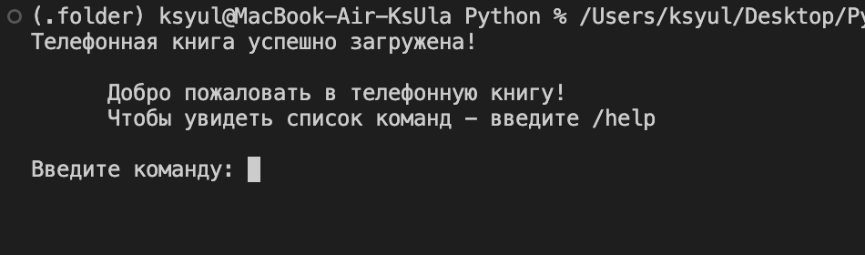
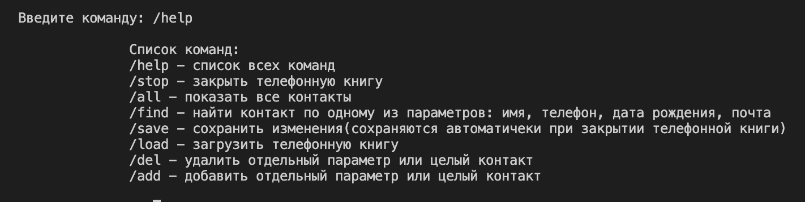
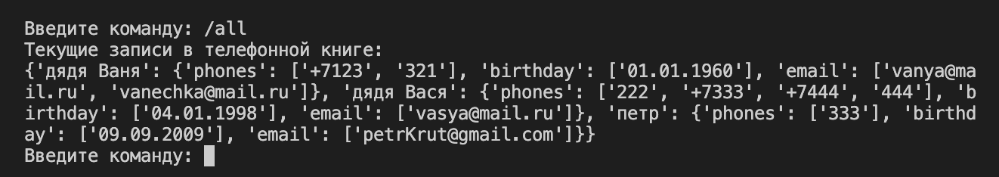
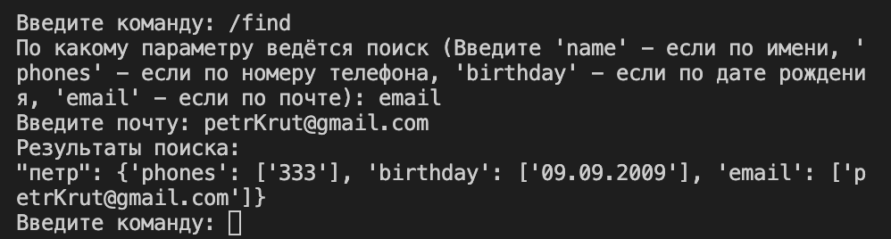
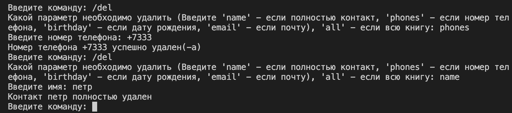
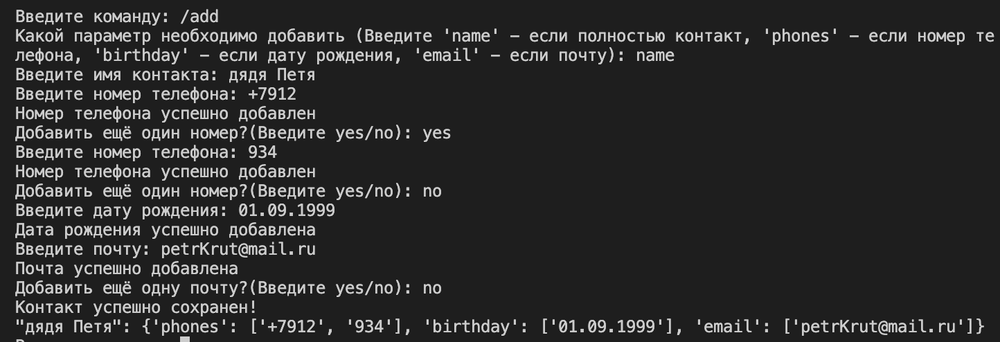
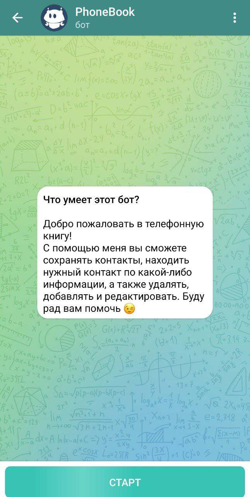

# Телефонная книга
Телефонная книга даёт возможность записывать номера телефонов, почту, дату рождения контактов.

## Команды, которые можно использовать:

+ ### /help - вызвать список всех команд

+ ### /stop - закрыть телефонную книгу
+ ### /all - показать список всех контакты

+ ### /find - найти контакт по одному из параметров: имя, телефон, дата рождения, почта

+ ### /save - сохранить изменения(сохраняются автоматичеки при закрытии телефонной книги)
+ ### /load - загрузить телефонную книгу
+ ### /del - удалить отдельный параметр или целый контакт

+ ### /add - добавить отдельный параметр или целый контакт

## Телеграмм бот:
В файле new_tg_bot.py написан код для телеграмм бота.

Ссылка на тг бот: https://t.me/PhoneBook_By_Ksenia_bot

